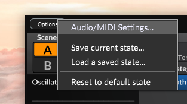
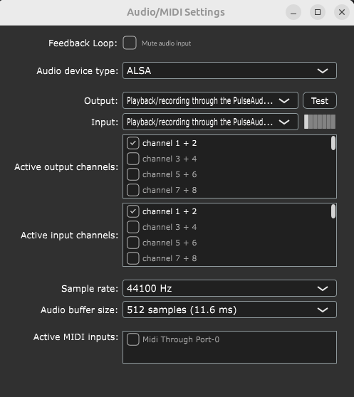
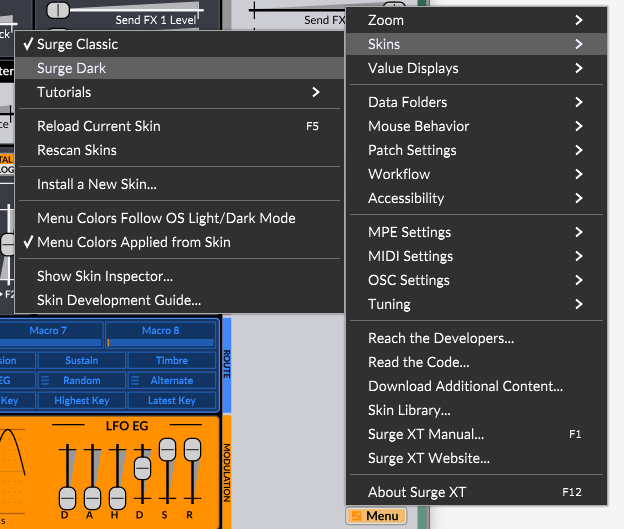
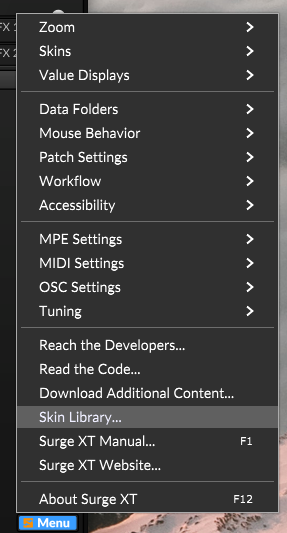
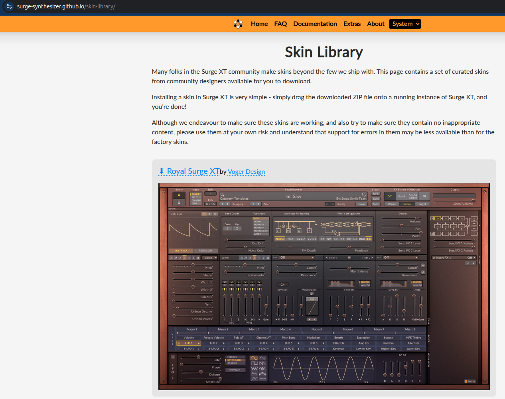
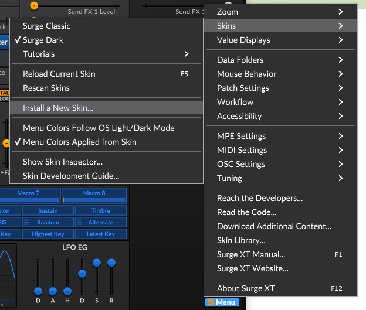
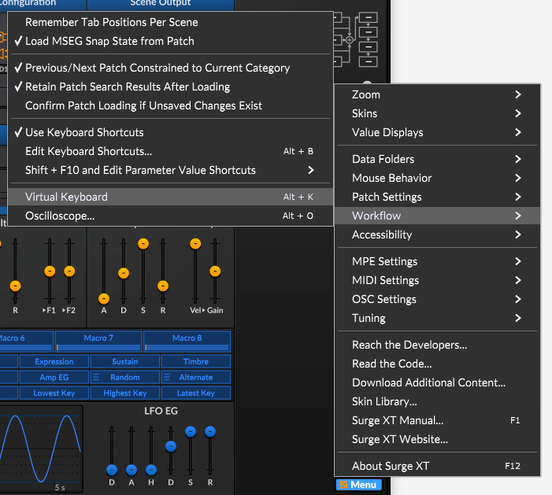
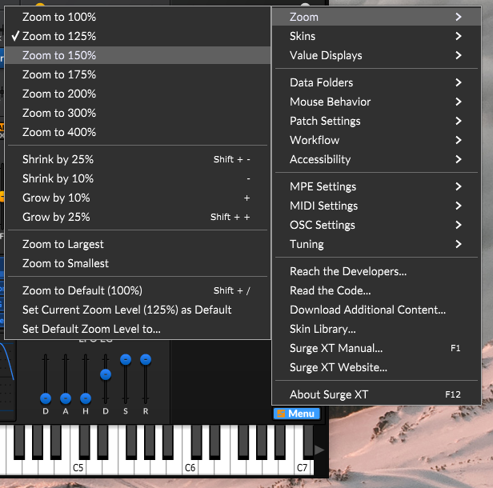

# Configurar Surge XT por primera vez

A continuación se describen pasos esenciales para confirgurar SurgeXt por primera vez.

# Opciones MIDI y salida de audio

- Hacer click en el botón de [Options]
- Seleccionar la opción "Audio/MIDI Settings..."

- Deshabilitar la opción "Feedback Loop" [ ] Mute audio Input.
- Presionar el botón de "Test" para probar el audio.

> *En caso de contar con controlador o teclado MIDI, seleccionarlo en el recuadro de  **Active MIDI Inputs***

## Instalar nuevo Skin

Abre el archivo de Skin para comprobar las opciones disponibles.

- Click sobre el botpon Menu y seleccionar la opción **Skins** 

- Prueba seleccionando la opción **Surge Dark**

> Ahora instalaremos nuevos Skins

- Ir a **Menu > Skin Library** 

- Este te lleva a la página [skin-library](https://surge-synthesizer.github.io/skin-library)

- Descargar los archivos comprimidos *(.zip)*

- Descomprimir los archivos *.zip* en el directorio *$HOME/Documents/SurgeXT/Skings*

- Ir a **Menu > Skin > Install a New Skin**

- Abrir los archivos **skin.xml**

- Ir a **Men > Skin > Rescan Skin** para registrar los cambios

## Desplegar el teclado virtual

Si no cuentas con un controlador o teclado MIDI, el teclado virtual funciona muy bien.

- Ir a **Menu > Workflow > Keyboard**.

> También es posible desplagarlo utilizando la combinación de teclas [Alt + K]

## Ajustar el tamaño de la pantalla de Surge XT

- Ir a Menu > Zoom > N%...

> O también se puede presionar la tecla cambio (Shift) y la tecla (+) o (-)
