# Síntesis

## Objectivo

Crear un sonido similar al de un órgano **Hammond**, el cual ha sido un pilar fundamental en géneros como el **jazz**, el **rock**, el **blues**, el **gospel** y el **soul**.

### Referencia histórica: 

- **[El órgano Hammond: retrato e historia de un instrumento inmortal](https://woodbrass.es/blogs/leyenda/el-organo-hammond-retrato-e-historia-de-un-instrumento-inmortal?srsltid=AU7gw4XsXA55Q7rFlJdFK0FwOeVpEqHCFnk9hApyv0Ewb5mJi2-bJ-M6)**

- [Naa Naa Naa - Cory Henry, Düsseldorf Festival!](https://youtu.be/50Iy_WWisAQ?si=VgGMWBkt0D84GzEc)

- [ＨＡＭＭＯＮＤ ＮＯＩＲ ✦ Dark Jazz & Vintage Organ Grooves Vol.1 | Cocktail bar music](https://youtu.be/pGWtmyIHAxw?si=1U85h0Dd8ODMLj6M)

# Pasos

## Forma de onda de los osciladores

1. Abre la aplicación de SurgeXT.

2. Selecciona el oscilador 1 (**Oscillator 1**) en la escena A (**Scene A**).

3. Comienza trabajando con la onda sinosoidal (**Sine**).

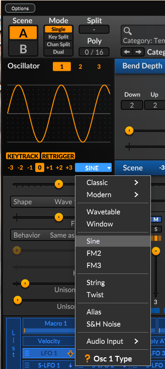

4. En los parámetros configura lo siguiente:
    - Desafina 10 centavos. (*Unison Detune = 10 cents*)
    - Utiliza tres voces. (*Unison Voices = 3*)

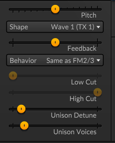

5. Selecciona el oscilador 2 (**Oscillator 2**) y configura que suene una octava baja. (**-1**)

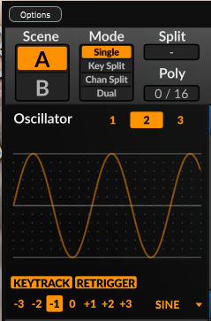

- Configura los mismos parámetros de Desafinación a 10 centavos, y tres voces como el paso 4.

6. Selecciona el oscilador 3 y congifura para que suene una octava alta. (**+1**)

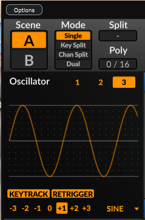

- Configura los mismos parámetros de Desafinación a 10 centavos, y tres voces como el paso 4.

7. Repite los mismos pasos con la escena B (**Scene B**)) con sus tres osciladores.

8. Una vez configruados todos los osciladores con sus respectivos parámetros, selecciona el modo de escena dual. (**Mode Dual**)

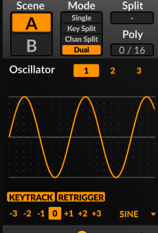

## Mezcla de osciladores y nivel de saturación

9. Para todas las escenas, habilita que suenen los 3 osciladores.

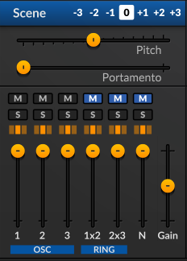

10. Para la escena A, reduce un poco el nivel de decibeles (db) de los osciladores 2 y 3.

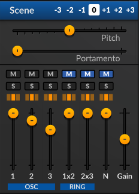

11. Para la escena B, reduce un poco el nivel de decibeles (db) de los osciladores 1, 2 y 3 como se vé en la imagen.

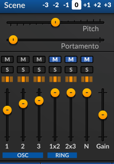

12. Para ambas escenas, configura el Portamento cercano a 5 ms.

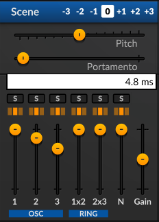

13. Para cada escena, en el Filtro 1, habilita el modelado de onda (**Waveshaper**) con nivel de saturaciión suave. (**Saturator > soft**).

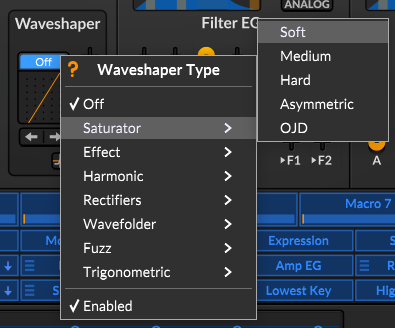

14. Haz click sobre el botón de la forma de onda y reduce el nivel de saturación cerca de 5 decibeles.

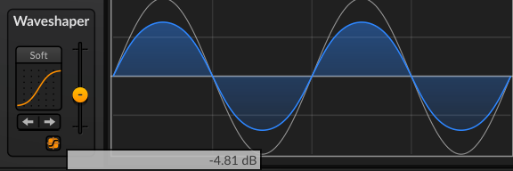

## Inserción de efectos

15. Selecciona el efecto de inserción para la escena A. Introduce el efecto: **Multieffects > Airwindows > Init**.

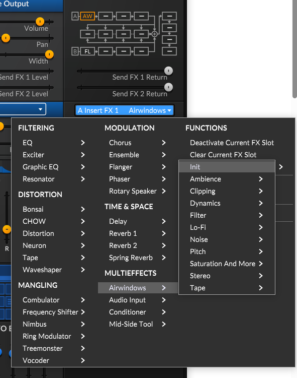

16. Para la escena B. Introduce el efecto: **Modulation > Flanger > Big Chorus**.

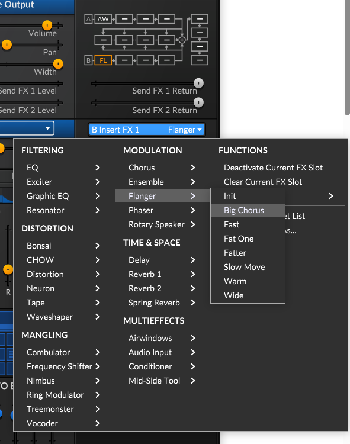

17. Selecciona el efecto global: **Modulation > Rotary Speaker > Rotor Chorus**.

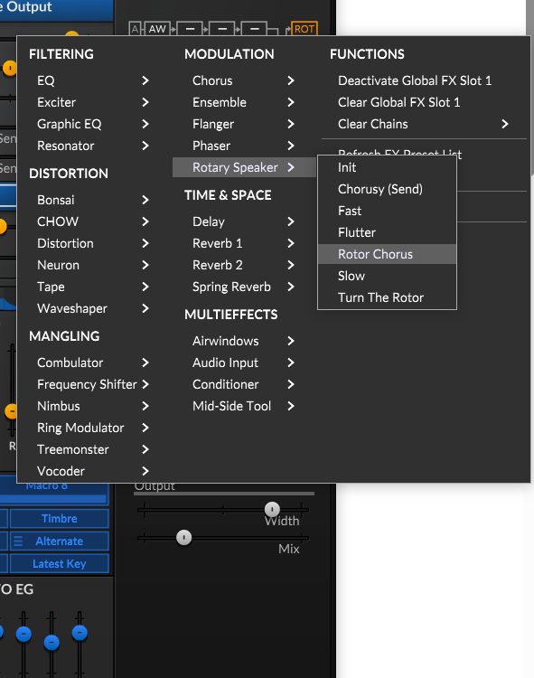

18. Configura los parámetros **Horn Rate** y **Rotor Rate** para que queden como se muestra en la siguiente imagen.

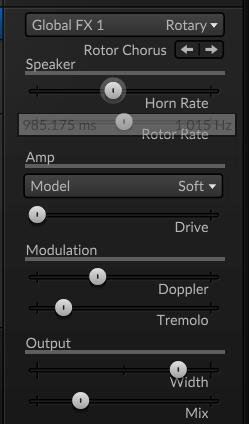

## Guardar el sonido nuevo (*Patch Save*)

19. Haz click sobre el botón de guardar (**Save**)

20. Introduce el nombre del sonido, su caegoría, y el autor.

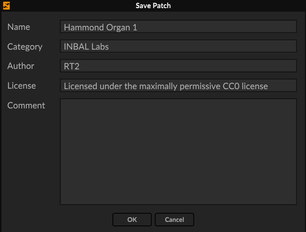

21. El nombre debe aparecer en el banco  de sonidos.

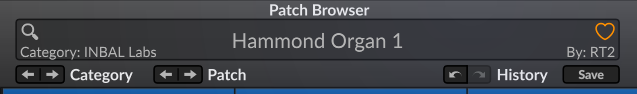