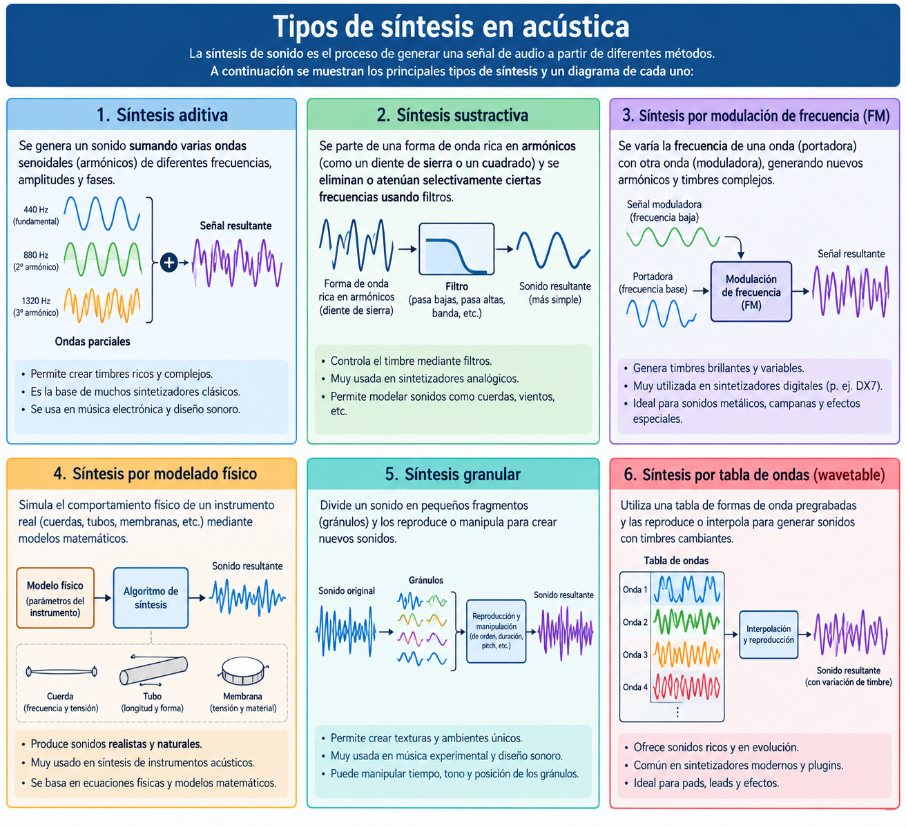
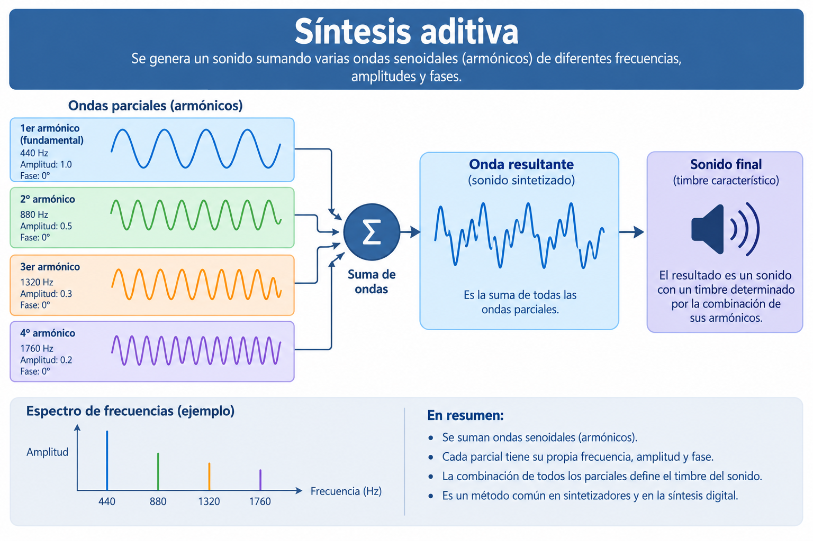
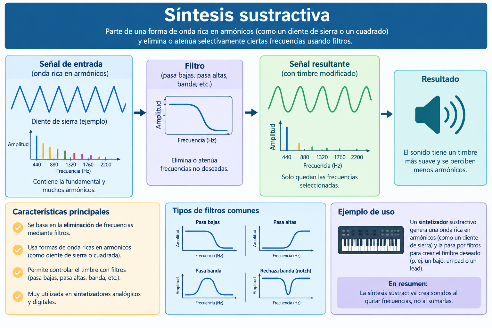
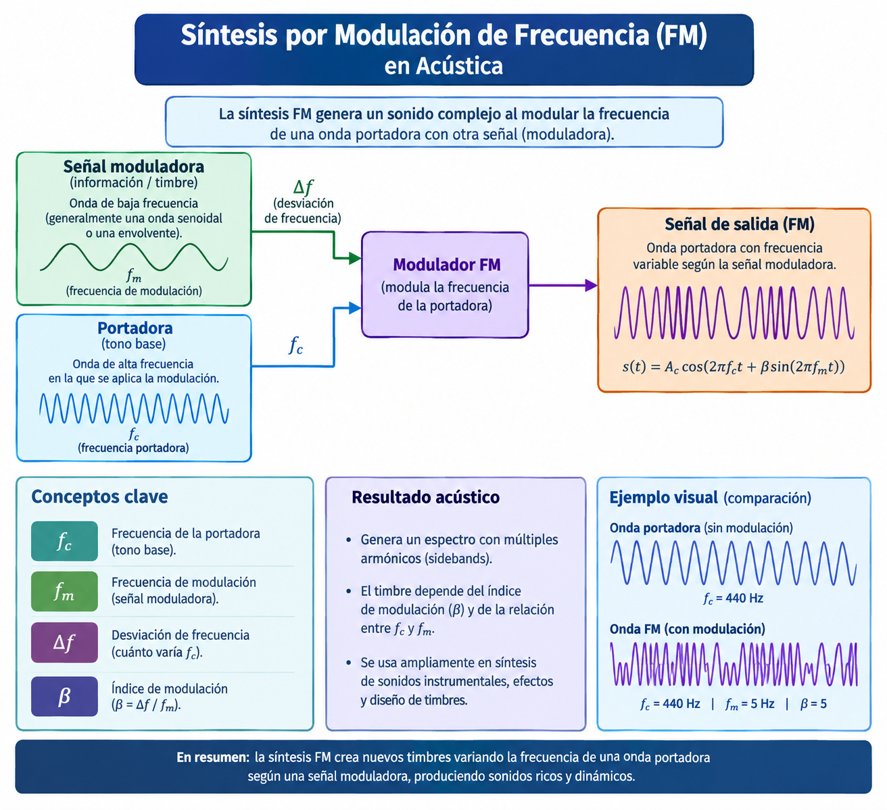
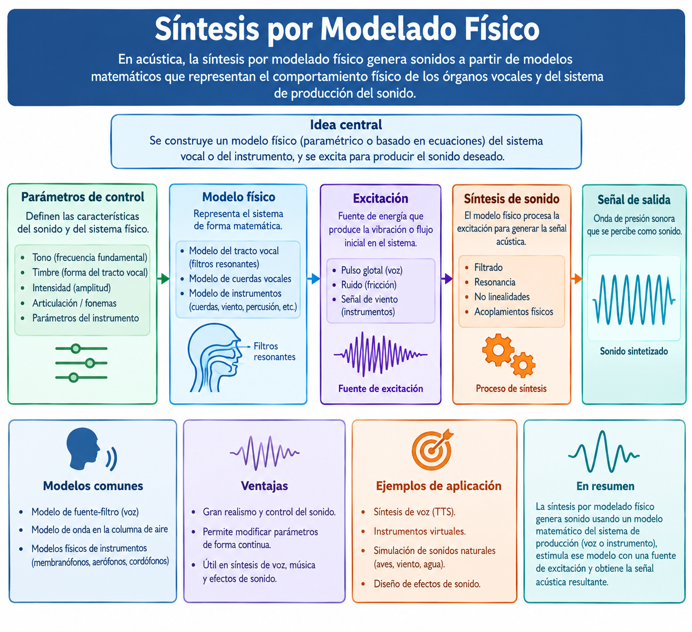
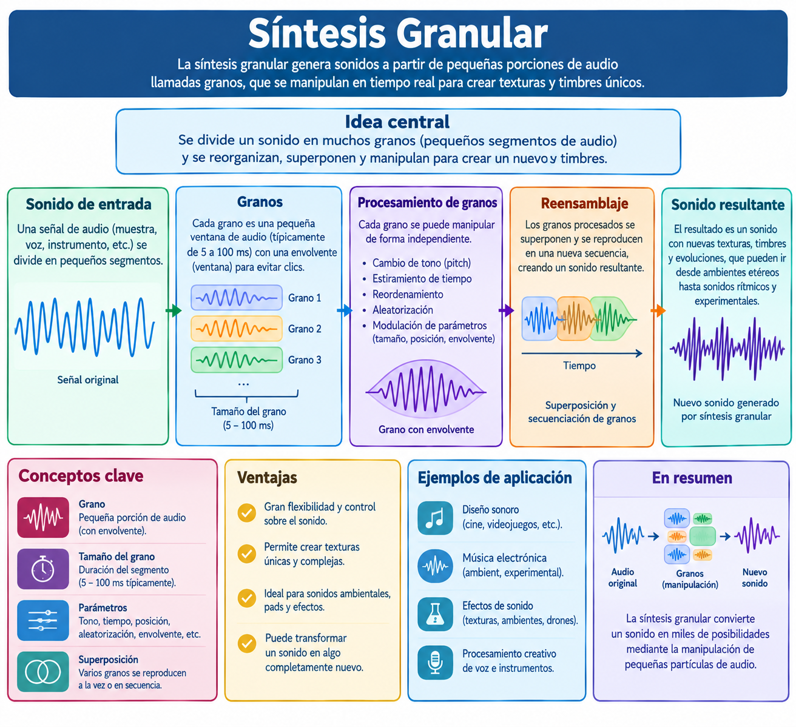
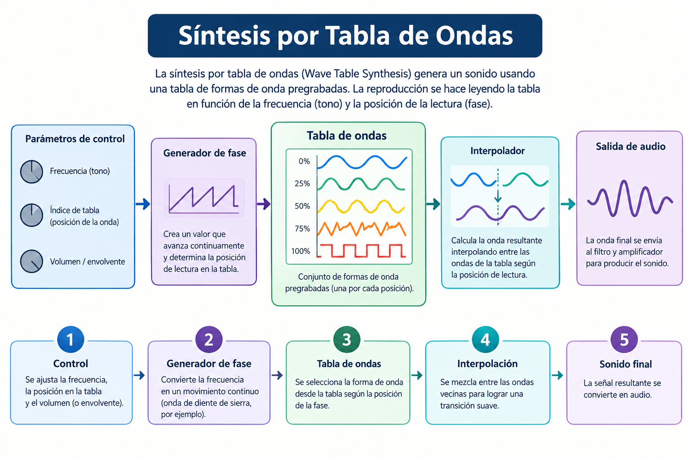

# :sound: Tipos de Síntesis en Acústica Musical

La síntesis de sonido es el método electrónico o digital para crear audio desde cero sin usar un instrumento tradicional. Cada tipo de síntesis utiliza una técnica matemática o de filtrado distinta para modelar las ondas sonoras.




## 1. Síntesis Aditiva

- **Descripción:** Suma múltiples ondas simples (generalmente senoidales) para construir un sonido complejo desde sus armónicos fundamentales.
- **Instrumentos Famosos:** 
  - **Órgano Hammond** (mediante sus barras de tracción/drawbars mecánicas).
  - **New England Digital Synclavier** (primeros modelos digitales de alta gama).

| **Diagrama conceptual:** |
|:--:|
||

```
[ Señal de Control / Teclado / MIDI ]
                 │
                 ├──────────────────────────┐
                 ▼                          ▼
       [ Generador de Envolvente ]   [ Frecuencia Fundamental (f0) ]
                 │                          │
                 │              ┌───────────┴───────────┐
                 │              ▼                       ▼
                 │       [ Armónico 1 (1xf0) ]   [ Armónico 2 (2xf0) ] ... [ Armónico N (Nxf0) ]
                 │              │                       │                         │
                 │              ▼                       ▼                         ▼
                 │        [ Oscilador 1 ]         [ Oscilador 2 ]   ...     [ Oscilador N ]
                 │              │                       │                         │
                 │              ▼                       ▼                         ▼
                 └──────> [ Amplificador ]      [ Amplificador ]    ...   [ Amplificador ]
                        (Controlado por Envolvente / VCA) (VCA)                 (VCA)
                                │                       │                         │
                                └───────────────────────┬─────────────────────────┘
                                                        ▼
                                           [ Mezclador / Sumador (Σ) ]
                                                        │
                                                        ▼
                                            [ Señal de Audio Compleja ]
```


## 2. Síntesis Sustractiva

- **Descripción:** Filtra y recorta frecuencias de una onda fuente que ya es rica en armónicos. Es el estándar de la síntesis analógica clásica.

- **Instrumentos Famosos:** 
  - **Minimoog (Moog)** (el sintetizador monofónico clásico por excelencia).
  - **Sequential Circuits Prophet-5** (pionero en la polifonía programable).
  - **Roland Juno-106** / **Jupiter-8**.

| **Diagrama conceptual:** |
|:--:|
||

```
[ Oscilador (VCO) ] 
       │  (Genera onda rica en armónicos: cuadrada, sierra)
       ▼
[ Filtro (VCF) ] ──(Modulado por)──> [ Generador de Envolvente (ENV) / LFO ]
       │  (Sustrae/atenúa frecuencias o bandas armónicas)
       ▼
[ Amplificador (VCA) ] ──(Modulado por)──> [ Generador de Envolvente (ADSR) ]
       │  (Controla la dinámica y el volumen general)
       ▼
  [ Salida de Audio ]
```

## 3. Síntesis por Modulación de Frecuencia (FM)

- **Descripción:** Altera la frecuencia de una onda (portadora) muy rápidamente usando otra onda (moduladora) para crear timbres complejos, brillantes y metálicos.

- **Instrumentos Famosos:** 
  - **Yamaha DX7** (el sintetizador digital icónico que definió el sonido de la década de 1980).
  - **Yamaha TX81Z** (famoso por su bajo digital 'Lately Bass').

| **Diagrama conceptual:** |
|:--:|
||

```
[ Generador de Envolvente ]       [ Generador de Envolvente ]
            |                                 |
            v                                 v
   [ Operador Modulador ] ---------------> [ Operador Portador ] ---> [ Salida de Audio ]
  (Frecuencia e Índice de Modulación)      (Frecuencia Base / Pitch)
```

## 4. Síntesis por Modelado Físico

- **Descripción:** Utiliza ecuaciones matemáticas avanzadas y algoritmos informáticos para imitar de manera precisa el comportamiento físico y la acústica de instrumentos mecánicos reales.

- **Instrumentos Famosos:** 
  - **Yamaha VL1** (primer sintetizador comercial basado completamente en modelado físico).
  - **Korg Prophecy** / **Z1**.


| **Diagrama conceptual:** |
|:--:|
||

```
[ Controles / Interfaz MIDI ] 
            │
            ▼
┌───────────────────────┐
│       EXCITADOR       │ ──(Fuerza / Energía inicial)
└───────────┬───────────┘
            │
            ▼
┌───────────────────────┐
│      RESONADOR        │ ──(Línea de retardo / Guía de onda con retroalimentación)
└───────────┬───────────┘
            │
            ▼
┌───────────────────────┐
│       RADIADOR        │ ──(Filtro de caja / Proyección acústica al aire)
└───────────┬───────────┘
            │
            ▼
     [ Sonido Final ]
```


## 5. Síntesis Granular

- **Descripción:** Divide una muestra de audio existente en microfragmentos llamados "granos" y los reorganiza en densidades y tonos totalmente nuevos.

- **Instrumentos Famosos:** 
  - **Spectrasonic Omnisphere** (motor granular potente integrado).
  - **Glitchmachines Palindrome** / **Tasty Chips GR-1** (sintetizador granular de hardware dedicado).

| **Diagrama conceptual:** |
|:--:|
||

```
[ AUDIO DE ENTRADA / ARCHIVO DE MUESTRA ]
                  │
                  ▼
         [ SEGMENTACIÓN ] 
  (Corte de la onda en micro-fragmentos)
                  │
                  ▼
         [ EL GRANULADOR ] ───◄ [ PARÁMETROS DE CONTROL ]
  (Generación de Granos de Sonido)       - Posición (Scan)
  - Ventana / Envolvente (Window)        - Tamaño / Duración (Size)
  - Forma de onda interna (Waveform)      - Tono / Afinación (Pitch)
                  │
                  ▼
   [ DISTRIBUCIÓN / ORGANIZACIÓN ]
   ┌──────────────┴──────────────┐
   ▼                             ▼
[Sincrónica]                  [Asincrónica]
(Periodos regulares)          (Nubes aleatorias)
   └──────────────┬──────────────┘
                  │
                  ▼
       [ MEZCLA / ENVOLVENTE ] 
       (Superposición / Overlap)
                  │
                  ▼
     [ AUDIO DE SALIDA / TEXTURA ]
```


## 6. Síntesis por Tabla de Ondas (Wavetable)

- **Descripción:** Reproduce y hace una transición suave (interpolación) a través de una secuencia de formas de onda pregrabadas en una matriz digital.

- **Instrumentos Famosos:** 
  - **PPG Wave** (pionero en los años 80).
  - **Waldorf Microwave**.
  - **Xfer Records Serum** (sintetizador virtual moderno de referencia).


| **Diagrama conceptual:** |
|:--:|
||

```
[ Fuentes de Modulación ] ----> (LFO, Envolventes, Velocity)
           │
           ▼
[ Tabla de Ondas (Wavetable) ] -> Contiene una pila de "frames" (ej. 256 formas de onda de un ciclo)
           │
           ▼
[ Escáner / Posición (Index) ] -> Selecciona o interpola suavemente entre las ondas de la tabla
           │
           ▼
[ Oscilador Wavetable ] -------> Produce la señal periódica a la frecuencia (pitch) de la nota pulsada
           │
           ▼
[ Moduladores / Warp ] --------> Modificaciones geométricas de la onda (PWM, Mirror, Sync)
           │
           ▼
[ Filtros (VCF) ] -------------> Recortan o realzan frecuencias armónicas
           │
           ▼
[ Amplificador / Envolvente ] -> Controla la dinámica de volumen (ADSR) de la nota
           │
           ▼
       [ Salida de Audio ]
```

---

# :book: Referencias 
- Britannica, T. Editors of Encyclopaedia (2023). [*Subtractive synthesis*](https://www.britannica.com/topic/subtractive-synthesis). Encyclopedia Britannica. 
- Wikipedia contributors. (2024). [*Frequency modulation synthesis*](https://en.wikipedia.org/wiki/Frequency_modulation_synthesis). Wikipedia, The Free Encyclopedia. 
- Unison Audio. (2022). [*Additive Synthesis: The Basics & Top 5 Additive Synths*](https://unison.audio/additive-synthesis/). Unison Audio Blog. 
- EDMProd. (2021). [*Subtractive Synthesis: The Complete Guide for Producers*](https://www.edmprod.com/subtractive-synthesis/). EDMProd. 
