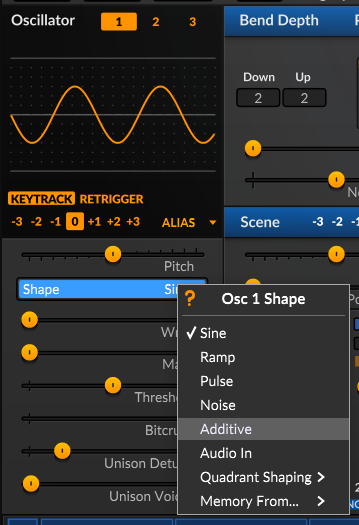
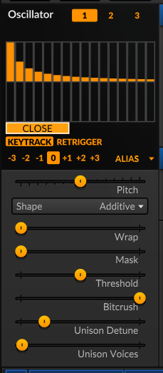
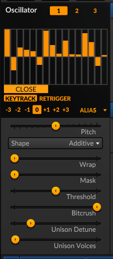
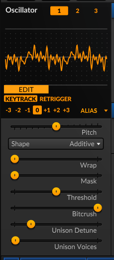
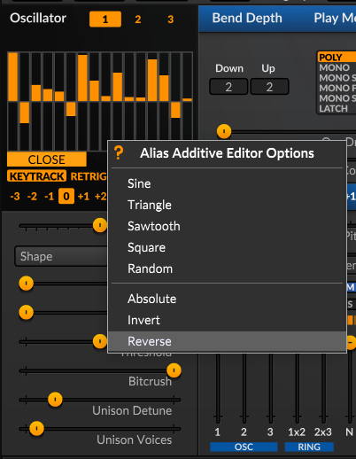
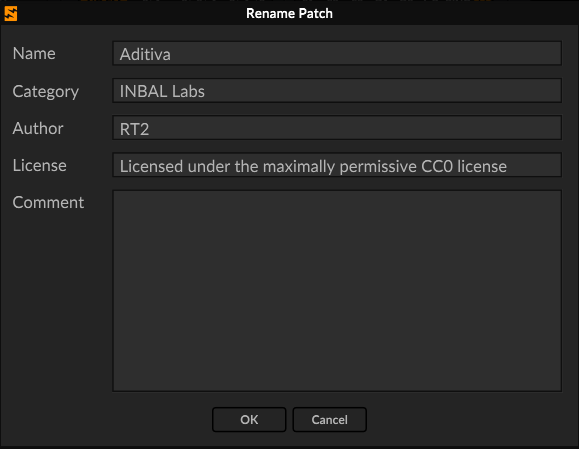

# :sound: Síntesis Aditiva

La síntesis aditiva en acústica y audio es una técnica de creación de sonido que consiste en sumar múltiples ondas simples (específicamente, ondas sinusoidales) con frecuencias, amplitudes y fases determinadas para construir un timbre o sonido complejo

## ¿Cómo funciona?

- **Punto de partida**: Se parte del silencio (o de cero) y se van añadiendo componentes de manera progresiva, al contrario de la síntesis sustractiva.

- **Ondas sinusoidales**: Cada onda añadida actúa como un bloque elemental o tono puro.

- **Armónicos y parciales**: Al combinar frecuencias que son múltiplos enteros de una frecuencia base (frecuencia fundamental), se generan armónicos que definen el color o carácter del sonido (el timbre).

- **Envolventes temporales**: Se aplican controles de volumen independientes (envolventes) a lo largo del tiempo para cada componente, logrando que el sonido evolucione de manera realista.

## :musical_note: Síntesis Aditiva en Surge XT

Puedes realizar síntesis aditiva básica en Surge XT utilizando el oscilador ((Alias)) y seleccionando la forma de onda ((Additive)).

### Pasos para Configurar la Síntesis Aditiva

- **Selecciona el oscilador**: Haz clic en **Osc 1**, **Osc 2** o **Osc 3** para mostrar el oscilador que deseas editar.

- **Elige el algoritmo**: Cambia el tipo de oscilador (ubicado en la parte inferior derecha del panel del oscilador) a **Alias**.

- **Selecciona la forma aditiva**: En el menú desplegable **Shape** del oscilador **Alias**, selecciona **Additive**.

- **Abre el Editor Aditivo**: Haz clic en el botón **Edit** (o Additive Editor) que aparece junto a los controles de forma de onda.

- **Dibuja tus armónicos**: Se abrirá una ventana que te permite ajustar las amplitudes individuales de 16 armónicos parciales.

    

    - Haz clic y arrastra verticalmente sobre las barras de armónicos para subir o bajar sus niveles de volumen.

    

    - Haz clic derecho dentro de la cuadrícula del editor para cargar rápidamente formas predeterminadas o realizar operaciones matemáticas en la serie de armónicos.

    

> *Guarda los cambios si lo deseas y reinicia el patch.*

---

## :book: Referencias

- **Ace Studio**. (s.f.). [*What is additive synthesis in sound design and music - production?*](https://acestudio.ai/blog/what-is-additive-synthesis/) Ace Studio Blog.

- **Apple Support**. (s.f.). [*Síntesis aditiva*](https://support.apple.com/es-mx/guide/logicpro/lgsife419a84/mac). Manual de uso de Logic Pro para Mac.
 
- **Colaboradores de Wikipedia**. (2024, 18 de agosto). [*Síntesis aditiva*](https://es.wikipedia.org/wiki/S%C3%ADntesis_aditiva). Wikipedia, - la enciclopedia libre.
 
- **eMastered**. (s.f.).[*Síntesis aditiva: Qué es y cómo funciona*](https://emastered.com/es/blog/additive-synthesis). eMastered Blog.
 
- **Smyth, T**. (s.f.). [*Music 171: Additive synthesis \[Apuntes de clase\]*](http://musicweb.ucsd.edu/~trsmyth/addSynth171/addSynth171.pdf). Department - of Music, University of California San Diego.
 
- **Universidad Nacional de Quilmes**. (s.f.). 4.2. [*Síntesis aditiva*](https://static.uvq.edu.ar/mdm/CPS/unidad-04-02.html). Componentes de - la Programación de Sonido.
 
- **Wikipedia contributors**. (2025, 23 de noviembre). [*Additive synthesis*](https://en.wikipedia.org/wiki/Additive_synthesis). Wikipedia, The Free Encyclopedia.

