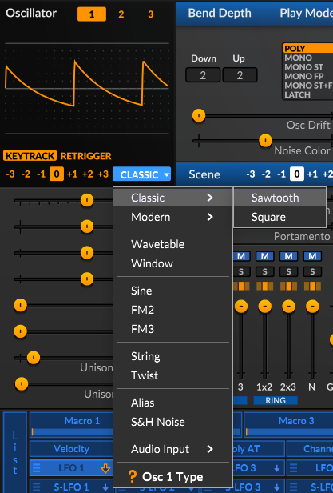
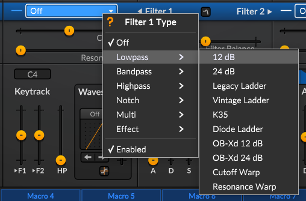
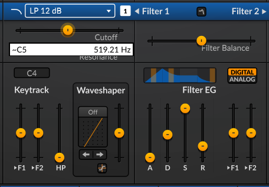
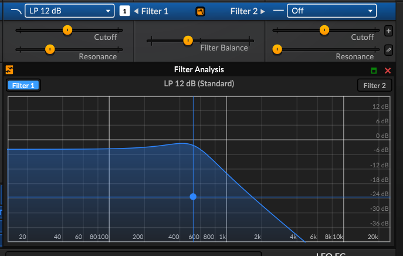
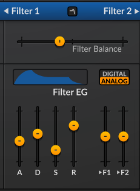
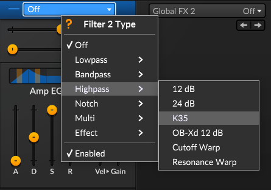
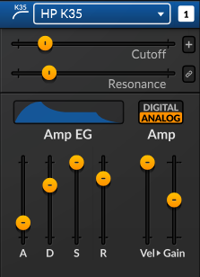
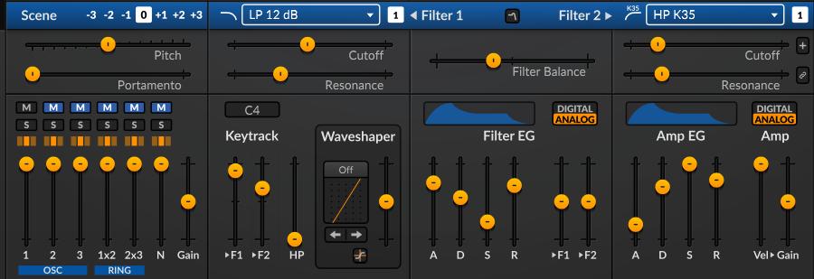
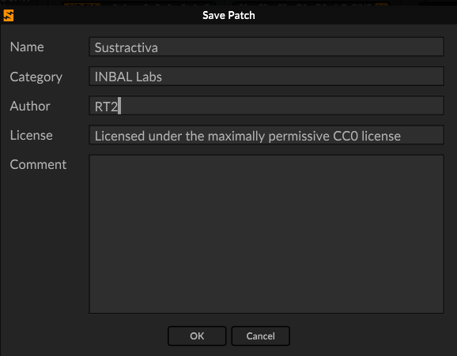

# :sound: Síntesis Sustractiva y Diseño de Sonido

La **síntesis sustractiva** es un método de creación y diseño de sonido que parte de una onda con alta densidad armónica y elimina frecuencias específicas mediante filtros para moldear el timbre final.

## 1. Componentes Principales y Bloques de Señal

- **Oscilador (VCO):** Genera la onda base rica en armónicos (como diente de sierra, cuadrada, pulso o triangular).
- **Filtro (VCF):** Es el núcleo del proceso; atenúa o elimina ciertas frecuencias para esculpir el color del sonido.
- **Envolvente (ADSR):** Modula cómo evoluciona el volumen o el brillo del sonido a lo largo del tiempo.
- **Amplificador (VCA):** Controla la ganancia y el nivel de salida del volumen general.

---

## 2. Cómo Funcionan los Tipos de Filtro

El filtro es el componente central de la síntesis sustractiva. Su función es "recortar" o atenuar ciertas frecuencias del sonido rico en armónicos que genera el oscilador. Los tipos de filtro principales se definen por las frecuencias que permiten pasar:

- **Filtro de Paso Bajo (*Low-Pass Filter* - LPF):** Permite el paso de las frecuencias bajas y atenúa las altas. Es el más común en música electrónica para crear bajos profundos o dar calidez a un sonido eliminando el brillo estridente.
- **Filtro de Paso Alto (*High-Pass Filter* - HPF):** Permite el paso de las frecuencias altas y atenúa las bajas. Se utiliza para limpiar el sonido de "barro" o frecuencias graves innecesarias, haciendo que un sintetizador suene más delgado y afilado.
- **Filtro de Paso Banda (*Band-Pass Filter* - BPF):** Permite el paso de un rango o "banda" específica de frecuencias, atenuando todo lo que esté por encima y por debajo de ese rango. Es ideal para crear efectos de tipo teléfono o radio vieja.
- **Filtro de Rechazo de Banda (*Notch Filter* o *Band-Reject*):** Hace lo opuesto al paso banda; elimina una franja estrecha de frecuencias y deja pasar todo lo demás.

### Parámetros clave del filtro
- **Frecuencia de Corte (*Cutoff*):** El punto exacto (en Hertz) donde el filtro empieza a actuar.
- **Resonancia (*Resonance* o *Q*):** Enfatiza o genera un "pico" de volumen justo en la frecuencia de corte, lo que produce un sonido silbante o un carácter más agresivo y ácido.

---

## 3. El Papel de la Envolvente ADSR

La envolvente ADSR define **cómo cambia un sonido a lo largo del tiempo**. Aunque comúnmente controla el volumen (a través del amplificador), en la síntesis sustractiva también se usa constantemente para modular la frecuencia de corte del filtro, haciendo que el sonido cambie de brillo de forma dinámica.

Se divide en cuatro etapas consecutivas:

```text
Volumen / Filtro
   ^
Max|     /\
   |    /  \
   |   /    \________ (Sustain)
   |  /              \
   | /                \
0  +---------------------> Tiempo
     [A]  [D]          [R]
   (Attack) (Decay)  (Release)

  |---Nota Presionada---| |-Nota Soltada-|
```

- **A - Ataque (*Attack*):** El tiempo que tarda el sonido en llegar desde el silencio absoluto hasta su punto máximo de volumen o brillo tras presionar una tecla. Un ataque rápido (0 ms) es ideal para percusiones; un ataque lento es para colchones atmosféricos (*pads*).
- **D - Caída (*Decay*):** El tiempo que tarda el sonido en bajar desde el pico máximo del ataque hasta el nivel de sostenimiento (*Sustain*).
- **S - Sostenimiento (*Sustain*):** El **nivel de intensidad** (no un tiempo) en el que se estabiliza el sonido mientras mantengas la tecla presionada.
- **R - Liberación (*Release*):** El tiempo que tarda el sonido en extinguirse por completo e irse a silencio una vez que sueltas la tecla.

---

# Síntesis Sustractiva en Surge XT

Puedes hacer síntesis sustractiva en **Surge XT** comenzando con una forma de onda rica en armónicos desde un oscilador, esculpiendo su contenido de frecuencias con la sección de filtros y controlando el volumen y el movimiento del filtro mediante envolventes.

## 1: Inicializar un parche (Patch)
- Abre Surge XT y selecciona un parche inicializado (*initialized* o *default*) para borrar modulaciones complejas.
- Asegúrate de trabajar en el modo de escena simple (Scene A) para mantener la ruta de la señal lo más clara posible.

## 2: Elegir la forma de onda del oscilador
- Ve a la sección del oscilador (Osc 1).
- Selecciona una forma de onda clásica y rica en armónicos desde el menú de tipo de onda, como una **diente de sierra (sawtooth)** o una **cuadrada/pulso (square/pulse)**. Estas proporcionan los sobretonos necesarios para el filtrado sustractivo.
- Revisa la sección de la mezcladora (*mixer*) para asegurarte de que el Osc 1 esté activo y con volumen.



## 3: Esculpir el sonido con los filtros
- Localiza la sección de filtros (Filter 1 y Filter 2).
- Elige un tipo de filtro, como un **filtro de paso bajo (LPF)**, el cual permite pasar las frecuencias graves mientras corta las agudas.
- Ajusta la perilla de **Frecuencia de Corte (Cutoff)** hacia abajo para eliminar el brillo de los agudos, y añade un poco de **Resonancia (Resonance)** para enfatizar las frecuencias justo en el punto de corte.
- Configura el enrutamiento de los filtros (como *Serial* o *Dual*) en el encabezado de la sección según si deseas que un filtro alimente al siguiente o procesar las rutas por separado.








## 4: Modular con envolventes (Envelopes)
- Usa la envolvente de amplitud o volumen (**Amp Env**) para controlar cómo sube y baja el volumen general cuando presionas y sueltas una tecla MIDI (ajustando *Attack, Decay, Sustain* y *Release*).
- Asigna una segunda envolvente (como **Env 2**) para modular el corte del filtro a lo largo del tiempo: haz clic y arrastra la ruta de modulación desde la envolvente hasta el parámetro de *Cutoff* del filtro para darle al sonido un barrido dinámico de apertura o cierre.









## 5: Guarda el nuevo sonido



---

## :book: Referencias
- **ACE Studio**. (2025). *Subtractive synthesis explained for music producers*. ACE Studio Blog. https://acestudio.ai/blog/what-is-subtractive-synthesis/
- **EDM Prod**. (2021). *Subtractive synthesis: The complete guide for producers*. EDM Prod. https://www.edmprod.com/subtractive-synthesis/
- **FabFilter**. (s.f.). *Basics: Subtractive synthesis*. FabFilter Learn. https://www.fabfilter.com/learn/synthesis-and-sound-design/basics-subtractive-synthesis
- **Roland Corporation**. (s.f.). *A beginner's guide to subtractive synthesis*. Roland UK Blog. https://www.roland.com/uk/blog/guide-to-subtractive-synthesis/
- **Surge Synth Team**. (2026). *Surge XT User Manual*. Recuperado de [https://surge-synthesizer.github.io/manual-xt/](https://surge-synthesizer.github.io/manual-xt/)
- **Produce With Me**. (2023, 19 de abril). *SurgeXT: The Ultimate Free Synth (Quick Start Guide)* [Video]. YouTube. Recuperado de [https://www.youtube.com/watch?v=aAXRsFlf0Ho](https://www.youtube.com/watch?v=aAXRsFlf0Ho)
- **eMastered**. (s.f.). *Síntesis sustractiva: Qué es y cómo funciona*. eMastered Blog. Recuperado de [https://emastered.com/es/blog/subtractive-synthesis](https://emastered.com/es/blog/subtractive-synthesis)
