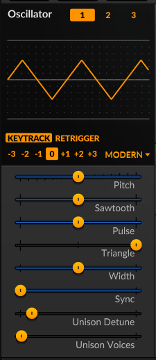
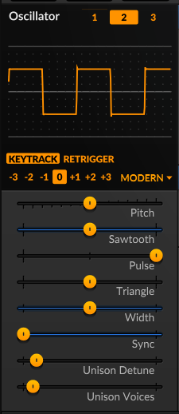

# Práctica 4: Crear un vibrato artificial con Frecuencia Modulada (FM) en SurgeXT

Para la siguiente práctica, solemante se trabajará con  el escenario A.

# Pasos

1. Abrir la aplicación Surge XT.

2. Configurar los osciladores de la siguiente manera:

| Oscilador | Parámetro | Valor |
| :--: | :-- | :-- |
| 1 | Tipo de Onda | Modern > Triangle (Triangular) | 
| 1 | Octava | 0 | 
| 1 | Pitch (altura) | 0 semitones (semitonos) | 
| 1 | Sawtooth (diente de sierra)  | 0 % | 
| 1 | Pulse (pulso) | 0 % | 
| 1 | Triangle (trángulo) | 100 % | 
| 1 | Width (ancho) | 50 % | 
| 1 | Sync (sincronización) | 0 semitones | 
| 1 | Unison Detune (desafinación de unísono) | 10 cents (centavos) | 
| 1 | Unison Voices (voces) | 1 voice (1 voz) | 

| Oscilador | Parámetro | Valor |
| :--: | :-- | :-- |
| 2 | Tipo de Onda | Modern > Square (Cuadrada) | 
| 2 | Octava | 0 | 
| 2 | Pitch (altura) | 0 semitones (semitonos) | 
| 2 | Sawtooth (diente de sierra)  | 0 % | 
| 2 | Pulse (pulso) | 100 % | 
| 2 | Triangle (trángulo) | 0 % | 
| 2 | Width (ancho) | 50 % | 
| 2 | Sync (sincronización) | 0 semitones | 
| 2 | Unison Detune (desafinación de unísono) | 10 cents (centavos) | 
| 2 | Unison Voices (voces) | 2 voice (2 voces) | 

| Oscilador | Parámetro | Valor |
| :--: | :-- | :-- |
| 3 | Tipo de Onda | FM2 (*frecuencia modulada para 3 operadores) | 
| 3 | Octava | 0 | 
| 3 | Pitch (altura) | 0 semitones (semitonos) | 
| 3 | M1 Amount (monto modulador 1)  | ~35% | 
| 3 |M1 Ratio () | 100 % | 
| 3 |  | 0 % | 
| 3 |  | 50 % | 
| 3 |  | 0 semitones | 
| 3 | Unison Detune (desafinación de unísono) | 10 cents (centavos) | 
| 3 | Unison Voices (voces) | 2 voice (2 voces) | 

> *FM2 (Modelo de 3 Operadores):* 
> - ***Estructura***: Consiste en **1 portadora** y **2 moduladores** que modulan la portadora de manera independiente (configuración paralela de moduladores).
> 
> - ***Proporciones (C:M ratios)***: Las proporciones entre la portadora y los moduladores están fijas en valores enteros.
> 
> - ***Carácter sonoro***: Gracias a las relaciones armónicas de números enteros, es un oscilador más limpio, musical y adecuado para melodías, acordes, bajos tradicionales y sonidos armónicos.

